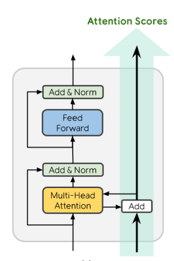
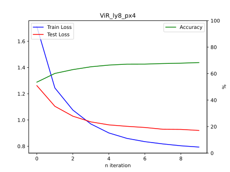
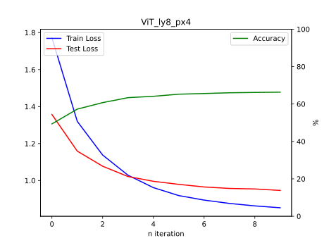

# RealFormer-Pytorch

<p align="center">
  
</p>

Implementation of RealFormer using pytorch. Includes comparison with classical Transformer on image classification task (ViT) wrt CIFAR-10 dataset.

Original Paper of the model : https://arxiv.org/abs/2012.11747

## So how are RealFormers at vision tasks?

Run the train.py with
```python
model = ViR(
        image_pix = 32,
        patch_pix = 4,
        class_cnt = 10,
        layer_cnt = 4
    )
```
to Test how RealFormer works on CIFAR-10 dataset compared to just classical ViT, which is

```python
model = ViT(
        image_pix = 32,
        patch_pix = 4,
        class_cnt = 10,
        layer_cnt = 4
    )
```
...  which is of course, much, much smaller version of ViT compared to the origianl ones ().

## Results

**Model : layers = 4, hidden_dim = 128, feedforward_dim = 512, head_cnt = 4**

Trained 10 epochs

<p align="center">
  
</p>

<p align="center">
  
</p>

After 10'th epoch, Realformer achieves 65.45% while Transformer achieves 64.59%
RealFormer seems to consistently have about 1% greater accuracy, which seems reasonable (as the papaer suggested simillar result)

**Model : layers = 8, hidden_dim = 128, feedforward_dim = 512, head_cnt = 4**

<p align="center">
  
</p>

<p align="center">
  
</p>

Having 4 more layers obviously improves in general, and still, RealFormer consistently wins in terms of accuracy (68.3% vs 66.3%). Notice that **larger the model, bigger the difference** seems to follow here too. (I wonder how much of difference it would make on ViT-Large) 

When it comes to computation time, there was almost zero difference. (I guess adding residual attention score is O(L^2) operation, compared to matrix multiplication in softmax which is O(L^2 * D))

## Conclusion
Use RealFormer. It benifits with almost zero additional resource!

## To make a custom RealFormer for other tasks
Its not a pip package, but you can use the ResEncoderBlock module in the models.py to make a Encoder Only Transformer like the following :

```python

import ResEncoderBlock from models

def RealFormer(nn.Module):
...
  def __init__(self, ...):
  ...
    self.mains = nn.Sequential(*[ResEncoderBlock(emb_s = 32, head_cnt = 8, dp1 = 0.1, dp2 = 0.1) for _ in range(layer_cnt)])
  ...
  def forward(self, x):
  ...
    prev = None
    for resencoder in self.mains:
        x, prev = resencoder(x, prev = prev)
  ...
    return x
```
If you're not really clear what is going on or what to do, request me to make this a pip package.
