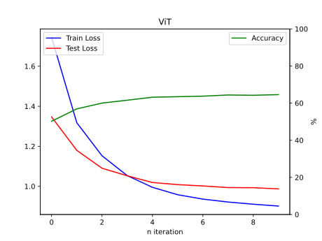

# RealFormer-Pytorch
Implementation of RealFormer using pytorch. Includes comparisons with classical transformer model on image classification task (CIFAR-10 dataset).

Original Paper of the model : https://arxiv.org/abs/2012.11747

## So how are RealFormers at vision tasks?

Run the train.py with
```python
model = ViR(
        image_pix = 32,
        patch_pix = 4,
        class_cnt = 10,
        layer_cnt = 4
    )
```
to Test how RealFormer works on CIFAR-10 dataset compared to just classical ViT, which is
```python
model = ViT(
        image_pix = 32,
        patch_pix = 4,
        class_cnt = 10,
        layer_cnt = 4
    )
```
## Results
Model : layers = 4, hidden_dim = 128, head_cnt = 4

Training on 10 epochs, following is training process




<p align="center">
  
</p>
After 10'th epoch, Realformer achieves 65.45% while Transformer achieves 64.59%
RealFormer seems to consistently have about 1% greater accuracy, which seems reasonable (as the papaer suggested simillar result)


## To make custom RealFormer Model
Its not a pip package, but you can use the ResEncoderBlock module in the models.py to make a Encoder Only Transformer like the following :

```python

import ResEncoderBlock from module

def RealFormer(nn.Module):
...
  def __init__(self, ...):
  ...
    self.mains = nn.Sequential(*[ResEncoderBlock(emb_s = 32, head_cnt = 8, dp1 = 0.1, dp2 = 0.1) for _ in range(layer_cnt)])
  ...
  def forward(self, x):
  ...
    prev = None
    for resencoder in self.mains:
        x, prev = resencoder(x, prev = prev)
  ...
    return x
```
If you're not really clear what is going on, request me to make this a pip package.


